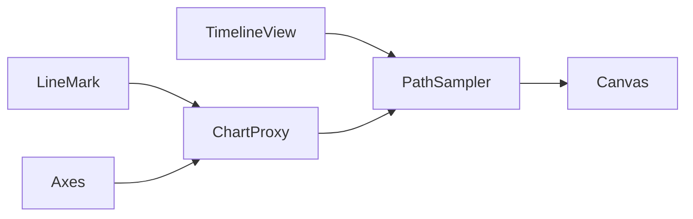

# Chart Line Trace Animation

## Summary

Added a subtle, continuously looping glow-dot-with-tail animation to all iOS line charts in **MarketPulse** and **StockPulse**. Existing `LineMark` strokes, widths, colors, and Catmull-Rom interpolation are unchanged — animation is a pure Swift Charts overlay.

## Approach

1. Keep all existing `LineMark` / `AreaMark` chart markup as-is.
2. Attach `.chartLineTrace(...)` after chart axis/scale modifiers.
3. Inside `.chartOverlay`, use `ChartProxy` to map data coordinates to plot pixels.
4. Drive animation with `TimelineView(.animation)` for a smooth continuous loop.
5. Draw head dot + tapered tail in a `Canvas` clipped to the plot frame.



## New Files

| File | Target |
|------|--------|
| `ios/MarketPulse/Utilities/ChartLineTrace.swift` | MarketPulse |
| `ios/StockPulse/Utilities/ChartLineTrace.swift` | StockPulse (identical copy) |

### Public API

```swift
ChartTraceSeries(id: String, points: [(date: Date, value: Double)], color: Color)

View.chartLineTrace(
    series: [ChartTraceSeries],
    style: .standard | .compact,
    phaseOffset: Int = 0
)
```

- **`.standard`** — full-size trend/detail charts
- **`.compact`** — sparklines (smaller dot, shorter tail, faster cycle)
- **`phaseOffset`** — desyncs animation in scroll lists (typically `ticker.hashValue`)

## Visual Tuning

| Constant | Standard | Compact |
|----------|----------|---------|
| Per-series duration | 2.0s | 1.2s |
| Handoff between series | 0.3s | 0.15s |
| Head dot radius | 3pt | 2pt |
| Head glow layers | 3 halos (5.8 / 4.2 / 2.8pt) | 3 halos (4.0 / 2.8 / 1.9pt) |
| Head glow opacity | up to ~58% line color | up to ~38% |
| Bright core highlight | white 45% / 35% | on head dot |
| Tail segments | 12 | 8 |
| Tail span (path fraction behind head) | 0.28 | 0.22 |
| Tail radius range | 3.0 → 0.6pt | 2.2 → 0.45pt |
| Tail body opacity max | 0.52 | 0.38 |
| Tail glow halo opacity max | 0.28 | 0.20 |

To adjust speed: edit `ChartLineTraceStyle.perSeriesDuration` and `handoffDuration`.

To adjust subtlety: edit head glow radii/opacities, tail segment count, `tailSpan`, and `tailGlowOpacity` in `ChartLineTraceStyle`.

### Glow enhancement (Jun 2026)

Increased visual definition without changing underlying line strokes:

- **Head:** layered triple halo + small white hot-spot core
- **Tail:** each segment draws a soft glow halo behind the solid dot; longer span and more segments
- **Trail length:** ~2× previous path coverage (0.15 → 0.28 standard, 0.12 → 0.22 compact)

## Behavior

- Multi-line charts: traces series 1 → series 2 → … → repeat.
- Single-line charts: traces the line → repeat.
- Pauses when chart scrolls off-screen (`onDisappear`).
- Disabled when **Reduce Motion** is enabled.
- Series with fewer than 2 points are skipped.

## Integration Points

### MarketPulse

- `NormalizedTrendChart.swift` — multi-line trend card
- `SparklineView.swift` — compact trace + `tracePhaseOffset` param
- `RippleTrackerView.swift` — ripple sparklines + dual comparison chart
- `WatchlistView.swift` — row sparklines + detail banner chart

### StockPulse

- `SparklineView.swift` — compact trace + `tracePhaseOffset` param
- `RippleTrackerView.swift` — `NormalizedChartCard` + ripple sparklines
- `TrendsView.swift` — per-catalyst trend charts
- `MarketView.swift` — index/industry/ticker sparklines
- `WatchlistView.swift` — row + detail sparklines

## Xcode Project

Both `ChartLineTrace.swift` files were added to their respective target **Utilities** groups and **Sources** build phases in:

- `ios/MarketPulse.xcodeproj/project.pbxproj`
- `ios/StockPulse.xcodeproj/project.pbxproj`

## Verification

Both targets build successfully:

```bash
xcodebuild -project MarketPulse.xcodeproj -scheme MarketPulse -destination 'platform=iOS Simulator,name=iPhone 17' build
xcodebuild -project StockPulse.xcodeproj -scheme StockPulse -destination 'platform=iOS Simulator,name=iPhone 17' build
```

## No CSS / Design System Changes

This is a native Swift Charts overlay only. No dashboard layout, card styling, or color palette changes were made.
